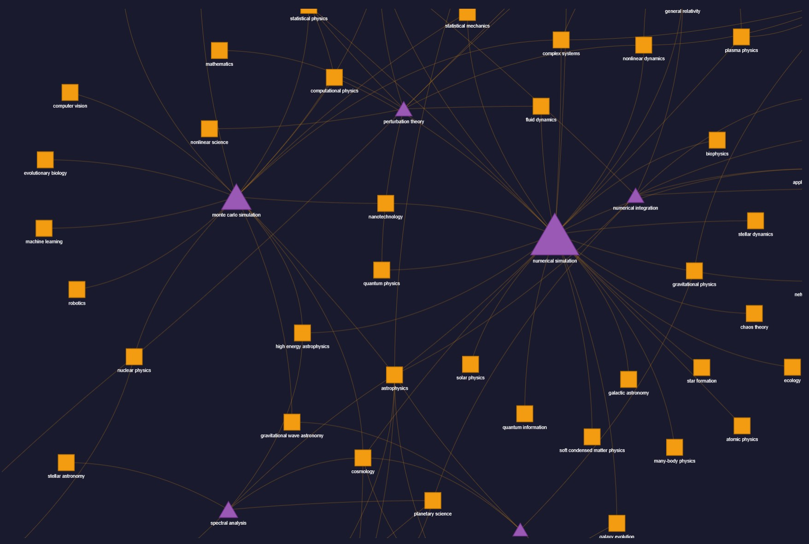

# Advanced GraphRAG: Knowledge Graph-Enhanced Retrieval with Neo4j + Qdrant

An end-to-end GraphRAG pipeline that combines **Qdrant** hybrid vector search with **Neo4j** Knowledge Graph traversal to build a retrieval system that goes beyond simple embedding similarity.

The graph doesn't just enrich results with metadata -- it **discovers new relevant documents** by traversing shared concepts and methods between papers.


## Architecture

<p align="center">
  
</p>

## Dataset

I used dataset `armanc/scientific_papers` from HuggingFace. For speed of development, I only used the first ArXiv 500 papers, which I saved in `papers_data.csv`.
Below is the code to download the entire dataset:

```python
from datasets import load_dataset

dataset = load_dataset(
    "armanc/scientific_papers",
    "arxiv",
    split="train",
    trust_remote_code=True,
    streaming=True
)
```

## Knowledge Graph Schema



**Nodes:**

| Type | Description | Example |
|------|-------------|---------|
| `Paper` | ArXiv scientific paper | "Additive models in semiparametric statistics" |
| `Concept` | Scientific concept with category | "kernel methods" (ML_Method) |
| `Method` | Algorithm or technique | "support vector machine" |
| `ResearchArea` | Broad research domain | "machine learning" |

**Relationships:**

| Type | Direction | Description |
|------|-----------|-------------|
| `MENTIONS_CONCEPT` | Paper --> Concept | Paper discusses a concept |
| `USES_METHOD` | Paper --> Method | Paper applies a method |
| `BELONGS_TO` | Paper --> ResearchArea | Paper belongs to a domain |
| `RELATED_TO` | Concept <--> Concept | Co-occurring concepts across papers (weighted) |
| `APPLIED_IN` | Method --> ResearchArea | Method used in a domain |
| `SHARED_METHOD` | Paper <--> Paper | Papers sharing common methods (weighted) |

The cross-paper relationships (`RELATED_TO`, `APPLIED_IN`, `SHARED_METHOD`) are what enable multi-hop discovery -- they connect papers that don't share any text similarity but are structurally related through the knowledge graph.

## Tech Stack

| Component | Technology | Role |
|-----------|-----------|------|
| **Vector Store** | [Qdrant](https://qdrant.tech/) | Hybrid search: dense vectors (COSINE) + BM25 sparse vectors + RRF fusion |
| **Knowledge Graph** | [Neo4j](https://neo4j.com/) | Multi-hop graph traversal, relationship discovery |
| **Embeddings** | OpenAI `text-embedding-3-small` | 1536-dimensional dense representations |
| **LLM** | OpenAI `gpt-4.1-mini` | Entity extraction (structured output) + answer generation |
| **Framework** | [LangChain](https://www.langchain.com/) | Orchestration, text splitting, prompt templates |

## Notebook Walkthrough

The notebook (`graphrag.ipynb`) is organized in 6 steps:

### Step 1 -- Setup & Configuration
Initialize Qdrant client, Neo4j driver, OpenAI embeddings and LLM.

### Step 2 -- Data Loading & Preparation
Load 500 ArXiv papers from `papers_data.csv` and chunk them (1000 chars, 200 overlap) using `RecursiveCharacterTextSplitter`.

### Step 3 -- Qdrant Vector Store Setup
Create a Qdrant collection with **dual vectors**:
- **Dense**: OpenAI embeddings (1536d, COSINE distance)
- **Sparse**: Built-in BM25 with IDF modifier

Embed all chunks and upload in batches. At query time, both signals are fused via **Reciprocal Rank Fusion (RRF)**.

### Step 4 -- Knowledge Graph Construction (Neo4j)
- Extract entities from each paper using GPT-4.1-mini with **Pydantic structured output** (up to 8 concepts, 8 methods, 3 research areas per paper)
- Ingest all nodes and direct relationships into Neo4j
- Build **cross-paper relationships**:
  - `RELATED_TO`: concepts co-occurring in 2+ papers
  - `APPLIED_IN`: methods linked to research areas through usage
  - `SHARED_METHOD`: papers connected by 2+ shared methods

### Step 5 -- GraphRAG Retrieval Pipeline
The core pipeline:
1. **Hybrid Search** (Qdrant): Dense + BM25 + RRF --> initial chunks
2. **Multi-Hop Traversal** (Neo4j): From initial papers, walk the graph to discover related papers via shared concepts/methods
3. **Graph-Discovered Retrieval** (Qdrant): Fetch chunks from newly discovered papers using filtered hybrid search
4. **Merge + Re-rank**: Combine initial and discovered results, deduplicate, score
5. **Enriched Context**: Attach graph metadata (concepts, methods, related concepts, discovery paths) to the context
6. **LLM Generation**: Answer using the full graph-enriched context

### Step 6 -- Demo Queries & Graph Visualization
Three demo queries with increasing complexity:
- Cross-domain concept linking (quantum mechanics + information theory)
- Method-based paper discovery (Gaussian kernels across ML and statistics)
- Complex multi-hop reasoning (Ising model + Heisenberg + superconductivity)

Each query produces:
- The answer with cited sources
- A breakdown showing which documents came from **vector search** vs **graph discovery**
- An **interactive html graph** visualizing the reasoning path

Plus a full Knowledge Graph overview visualization showing the top concepts, methods, and their interconnections.

## Getting Started

### Prerequisites

- Python 3.12+
- [uv](https://docs.astral.sh/uv/)
- [Docker](https://www.docker.com/)

### Setup

```bash
# Clone repository
git clone https://github.com/nynuz/Advanced-GraphRAG.git
cd Advanced-GraphRAG

# Start Qdrant
docker run -p 6333:6333 qdrant/qdrant

# Start Neo4j
docker run -p 7474:7474 -p 7687:7687 \
  -e NEO4J_AUTH=neo4j/your-password \
  neo4j:latest
```

Create a `.env` file in the project root:

```env
OPENAI_API_KEY=your-openai-api-key
NEO4J_USERNAME=neo4j
NEO4J_PASSWORD=your-password
```

Run the notebook:

```bash
uv run jupyter notebook graphrag.ipynb
```

## Design Decisions

**Why Qdrant hybrid search as the foundation?**
Combining dense semantic vectors with BM25 sparse vectors via RRF fusion provides the strongest possible baseline retrieval. The graph layer adds value on top of an already excellent vector search, rather than compensating for a weak one.

**Why multi-hop graph traversal?**
Plain vector search finds documents similar to the query. Graph traversal finds documents related to what the initial results are about -- papers that share methods, concepts, or research areas. This is especially powerful for complex, cross-domain queries where relevant papers might use completely different terminology.

**Why strict entity normalization?**
The extraction prompt enforces lowercase, singular forms, and canonical names. Without this, "SVM", "SVMs", "support vector machine", and "Support Vector Machines" would create four disconnected nodes instead of one, fragmenting the graph and reducing traversal effectiveness.

## License

MIT
